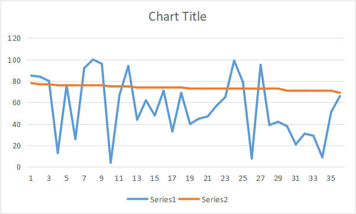
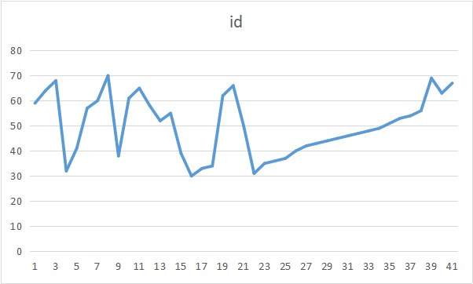
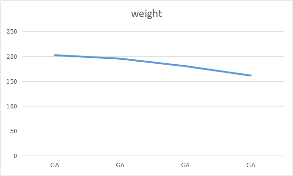
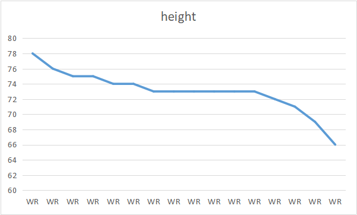
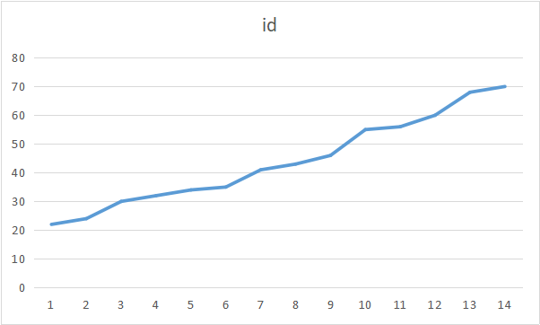

# ICA4

Q1: Rank the height from the highest to lowest in FR yr

```sql
SELECT id, height, year
FROM datasets.college_football_players
where year = 'FR'
order by height DESC
```



Q2:Rank the height from the highest to lowest in position WR

```sql
SELECT position, height
FROM datasets.college_football_players
where position = 'WR'
ORDER BY height DESC
```



Q3: Rank the weight from GA

```sql
select state, weight
from datasets.college_football_players
where state = 'GA'
order by weight DESC
```



Q4: Find the ID between 30 to 70
```sql
SELECT id, state
FROM datasets.college_football_players
WHERE id between '30' and '70'
ORDER BY state
```



Q5: Find the ID between 20 to 70 in JR yr
```sql
SELECT id, year
from datasets.college_football_players
where year = 'JR' and id between '20' and '70'
order by year
```


